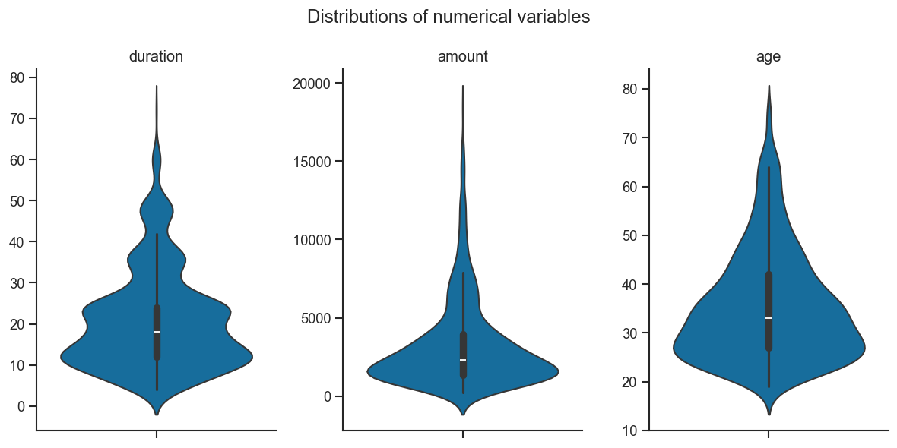
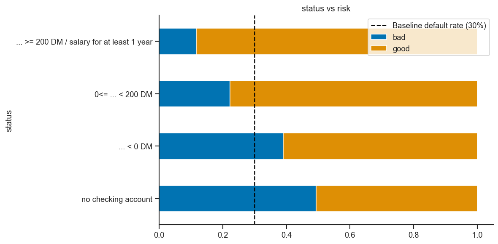
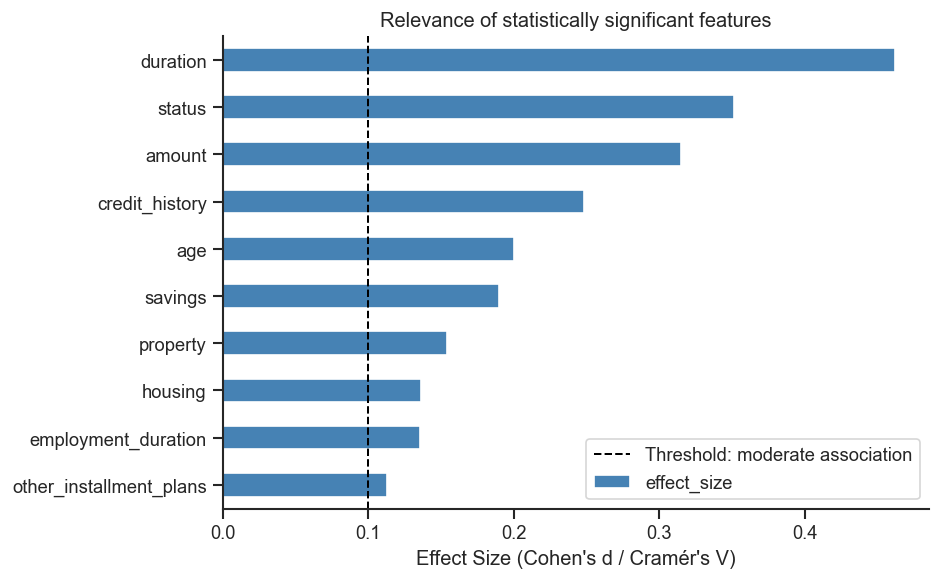
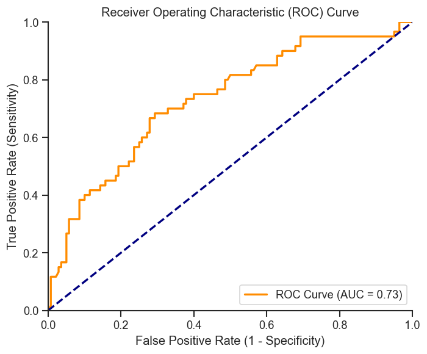
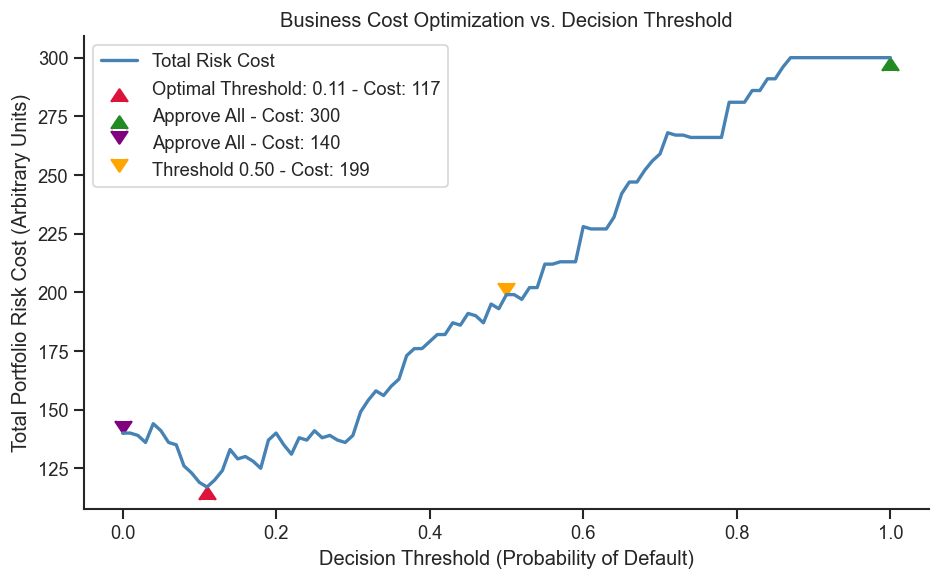
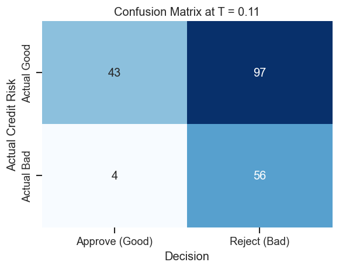

---
---



---
layout: default

---

An interpretable credit risk classification project using the South German Credit dataset.

This project combines exploratory data analysis, Weight of Evidence encoding, logistic regression and cost-sensitive threshold selection. The goal is not only to train a predictive model, but also to connect model evaluation with a realistic business problem: different classification errors can have different financial consequences.

---

## Project Overview

This project develops a simple and interpretable credit risk modeling workflow.

The analysis starts with data cleaning and exploratory data analysis, then extends into a logistic regression model using Weight of Evidence encoded features. Finally, the model output is evaluated under asymmetric misclassification costs to show how the choice of a classification threshold depends on the business objective.

The project is intended as a data science portfolio project and focuses on transparency, interpretability and business-oriented model evaluation.

---

## Business Problem

In retail lending, predicting credit risk determines whether to approve or reject loan applications. 
A standard machine learning workflow might classify applicants using a default probability threshold such as 0.5.
However, misclassification errors have asymmetric costs:

- **False Positive**: Rejecting a creditworthy applicant — the bank loses potential revenue and may damage customer relationships.
- **False Negative**: Approving a high-risk applicant — the bank faces potential default losses, which can be substantially higher.

Using accuracy alone to evaluate or tune a credit model can lead to suboptimal business decisions when these costs are not considered.

---

## Dataset

The project uses the corrected South German Credit dataset (available from UCI ML Repository). This dataset addresses known inconsistencies in the original German Credit dataset.

**Key feature groups:**
- Loan characteristics: amount, duration, purpose
- Financial status: savings, checking account
- Personal attributes: age, employment, housing
- Credit history information
- Target variable: credit risk

The dataset contains 1,000 records with 20 features describing loan applicants and their repayment behavior (good/bad credit risk).

The original dataset contains coded variables and coded category values. To improve readability, the accompanying code table was parsed and the original codes were mapped to descriptive variable names and category labels.

A complete overview of the variables is available in the [data dictionary](data_dictionary.md).

---

## Methodology

The workflow consists of the following steps:

1. Data loading and preprocessing
2. Parsing and mapping of coded variable values
3. Exploratory data analysis
4. Weight of Evidence encoding
5. Logistic regression modeling
6. Model evaluation
7. Cost-sensitive threshold selection

The focus is on building an interpretable modeling pipeline rather than maximizing predictive performance with a complex black-box model.

---

## Exploratory Data Analysis

The exploratory analysis investigates how default risk varies across applicant and loan characteristics.

The analysis includes:

- distributions of numerical variables
- default rates by categorical feature groups
- comparison of feature values across risk classes
- identification of potentially relevant predictors
- visual inspection of relationships between features and the target variable

The EDA step helps to understand the structure of the dataset before moving into modeling.



Only 3 of the features in the dataset are inherently numeric. 
We can see typica structures of right-skewedness in the age and credit amount columns, while duration peaks at year-marks,
quickly trailing off after the 2-year mark.




Analyzing the relationship between single features, we can make out features with good predictive power by comparing
the distribution of good and bad credit cases between feature groups, while keeping class imbalance (70% good, 30% bad) of the dataset in mind.




After visual inspection, statistic tests, using either a t-test or chi-squared-test, are used to evaluate statistical significance
of the different features. Furthermore, using Cohen's and Cramer's V, the effect size was investigated to also measure practical significance.
The analysis confirmed most of the previously identified key risk drivers. 

---

## WoE Encoding

Weight of Evidence (WoE) encoding transforms categorical variables into a numeric format suitable for logistic regression while preserving interpretability. This approach is commonly used in scorecard development because:

- Each category receives a meaningful numeric score
- The resulting model resembles traditional credit scorecards
- Feature contributions to risk are transparent and explainable

We calculate **Weight of Evidence (WoE)** for each category and binned interval on the training set to prevent data leakage:
$$WoE_c = \ln \left( \frac{\% \text{ Good (Non-default)}}{\% \text{ Bad (Default)}} \right)$$

- A **positive WoE** indicates a category with lower risk than the baseline portfolio (higher concentration of good borrowers).
- A **negative WoE** indicates a higher risk category (higher concentration of bad/defaulted borrowers).

We also calculate the **Information Value (IV)** to measure the overall predictive strength of each feature:
$$IV = \sum \left( \% \text{ Good} - \% \text{ Bad} \right) \times WoE$$

*Interpretation of IV in Banking:*
- $< 0.02$: Useless
- $0.02 \text{ to } 0.1$: Weak predictor
- $0.1 \text{ to } 0.3$: Medium predictor
- $0.3 \text{ to } 0.5$: Strong predictor
- $> 0.5$: Suspiciously strong (check for target leakage)


---

## Logistic Regression
Logistic regression was chosen as the modeling approach because it is:

- Widely used and accepted in regulated banking environments
- Interpretable — each feature’s impact on risk can be quantified
- Compatible with WoE encoding for scorecard-style implementations

**Feature importance (by Information Value):**

| Feature        | Coefficient (Beta) | IV       |
|----------------|-------------------|----------|
| status         | -0.8003           | 0.7190   |
| credit_history | -0.7808           | 0.3390   |
| savings        | -0.7856           | 0.2391   |
| duration_bin   | -0.5638           | 0.1839   |
| amount_bin     | -0.7038           | 0.1478   |
| property       | -0.7263           | 0.1267   |
| age_bin        | -0.6672           | 0.0988   |

- The features used in modeling are the key drivers identified in EDA
- All coefficients are negative, consistent with the WoE encoding direction

---

## Model Evaluation

Performance is evaluated using ROC-AUC and accuracy on a hold-out test set. The model achieves reasonable discriminative power while maintaining interpretability.



**Baseline model performance (default 0.5 threshold):**

| Metric       | Value  |
|--------------|--------|
| ROC-AUC      | 0.7292 |
| Gini         | 0.4583 |
| Accuracy     | 74%    |

---

## Cost-sensitive Threshold Selection

Instead of using the default 0.5 classification threshold, the model is tuned to minimize total portfolio cost under asymmetric misclassification costs. This approach:

- Compares decision thresholds under different cost scenarios
- Selects the threshold that minimizes business risk cost
- Demonstrates that threshold optimization can yield significant savings relative to naive accuracy-based decisions

- **False Negative (FN) of Default**: Approving a borrower who will default. This is extremely costly (capital loss of the loan amount).
- **False Positive (FP) of Default**: Rejecting a borrower who would have repaid. This results in lost interest income (opportunity cost).

Following bank-standard risk-reward trade-offs, we define an asymmetric cost matrix where:
- Cost of approving a bad borrower (FN) = **5**
- Cost of rejecting a good borrower (FP) = **1**
- Correct decisions (TP / TN) = **0**

Applying this to the model we compute the following cost curve:



The curve shows the cost is minimized at a threshold of 11%.

The confusion matrix at the optimum threshold is:




---

## Business Value: Asymmetric Cost Optimization

**Results:**

| Strategy                    | Total Cost | Savings vs. Approve All |
|-----------------------------|------------|-------------------------|
| Approve All                 | 300        | —                       |
| Reject All                  | 140        | 53.34%                  |
| Default Threshold (0.50)    | 199        | 33.67%                  |
| **Optimized Threshold (0.11)** | **117**  | **61.00%**              |

### 1. Quantification of Credit Risk Decisions
Rather than relying on qualitative rules or unweighted statistical tests, the model translates risk profiles into a single **Probability of Default (PD)**. By mapping features to transparent **Weight of Evidence (WoE)** values, credit analysts can instantly trace why a borrower has a specific risk score, satisfying both regulatory transparency and audit requirements.

### 2. Significant Capital Preservation
Moving from a naive "Approve All" lending strategy to our optimized model reduces total credit risk costs by **61.00%** (saving 183 cost units on the test set alone).
- An "Approve All" strategy leads to a default rate of 30%, incurring massive capital losses due to bad loans.
- The optimized model selectively filters out high-risk applicants, reducing the number of default occurrences from 60 to just 4 in the test set.

### 3. Asymmetric Decision Support
Standard machine learning models optimize for overall accuracy, which assumes false positives and false negatives are equally costly (a threshold of 0.5). By explicitly modeling the retail banking cost structure (where defaults cost 5x more than missed interest margins), we found that the **optimal decision threshold is 0.11**.
- Using the standard threshold (0.5) results in a risk cost of **199**.
- Shifting to the optimized threshold (0.11) reduces risk costs to **117**, representing a **41.21% cost reduction** compared to a standard machine learning model.
- This demonstrates that **aligning the model decision boundary with business economics yields significantly higher business value than technical model tuning alone**.

Although the cost-sensitive threshold reduces total modeled costs, it leads to a large number of false positives. In this context, false positives represent good applicants who would be rejected by the model. This may reduce credit losses but also creates opportunity costs through lost business. The result therefore reflects a very conservative decision strategy rather than an obviously optimal credit policy.

---

## Key Findings

- The German Credit dataset contains several features with visible differences in default rates.
- Logistic regression provides an interpretable baseline for credit risk classification.
- Weight of Evidence encoding helps convert categorical variables into a format suitable for transparent modeling.
- The choice of classification threshold has a strong impact on business outcomes.
- Accuracy alone is not sufficient when classification errors have asymmetric costs.

---

## Limitations

This is an educational portfolio project, not a production credit approval system:

- The German Credit dataset is small (1,000 records) and historical
- Features are simplified representations of real-world borrower characteristics
- No external validation or stress testing has been performed
- Regulatory compliance, fairness, and monitoring would be required for production use

---

## Tech Stack

- Python, Pandas, NumPy
- scikit-learn (Logistic Regression, metrics)
- Matplotlib, Seaborn
- Jupyter Notebook

---

## Repository Structure

```
.
├── README.md           # Technical documentation
├── docs/               # GitHub Pages site
│   └── index.md
├── notebooks/          # Main analysis notebook
├── src/                # Python modules for data processing
└── data/               # Raw dataset and code tables
```
---

